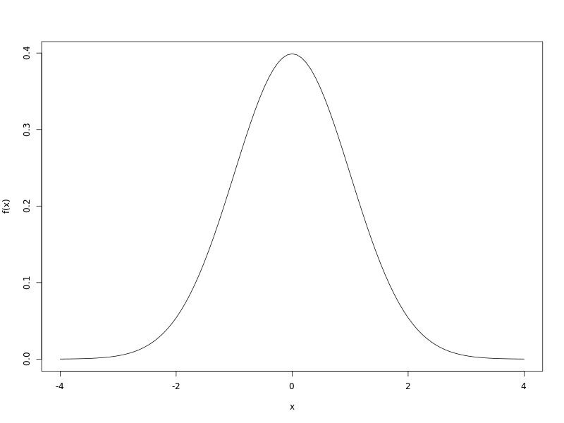
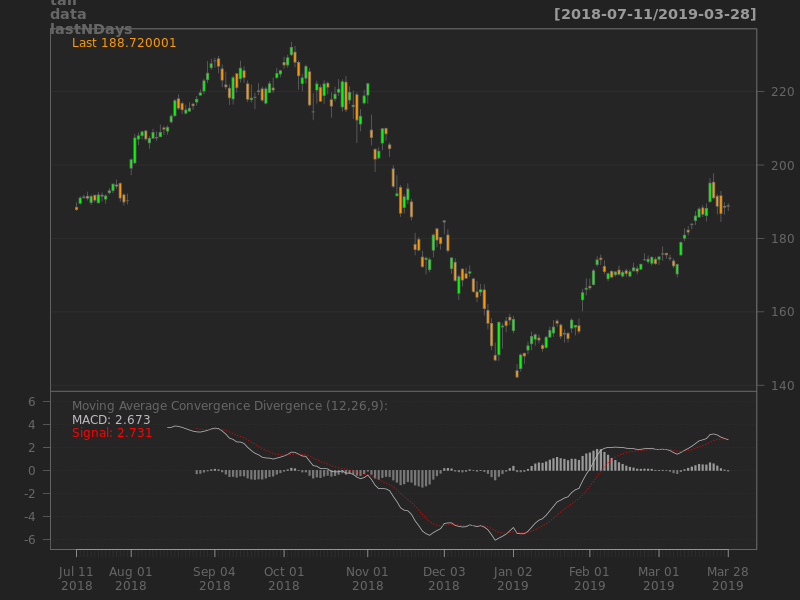

# R Cloud Examples

The aim of this project is to provide [Docker](https://www.docker.com)
images for running [RProject](https://www.r-project.org) and 
[Plumber](https://www.rplumber.io). Plumber is a library for running
REST web services in R. Project also contains few simple
examples of R REST web services.

## Images

### RProject image

[RProject image](https://hub.docker.com/r/jiripetrlik/rproject)
is based on Ubuntu and contains the last stable version
of R. Image is freely available on Docker hub and serves as
a base image for the Plumber image.

### Plumber image

[Plumber image](https://hub.docker.com/r/jiripetrlik/rproject-plumber)
allows user to simply run REST web service in R using
Plumber library. Default location of a web service definition
is `/app/default-app.R` which is a very simple "Hello world"
web service. This webservice can be simply overwritten or
its location can be changed using `APPLICATION`
environment variable.

### R Cloud Examples image
[R Cloud Examples image](https://hub.docker.com/r/jiripetrlik/r-cloud-examples)
is based on Plumber image and contains examples of R web services.
Source file for these web services can be found in `R/plumber.R`.

## Examples

Run Docker container with examples: `docker run -d --name r-cloud-examples -p 80:80
jiripetrlik/r-cloud-examples`

### Basic

```
# Print hello world in HTML
http://localhost

Hello world!!!
```

```
# Calculator (f is one of "add", "sub", "mul", "div")
http://localhost/calculator?operand1=50&operand2=10&f=mul

[500]
```

### Statistics

```
# Generate Gaussian random numbers
http://localhost/gaussian-random-numbers?n=5

[0.4087,1.2311,-2.1149,-0.5262,0.671]

# Generate Gaussian random numbers with mean=10 and sd=5
http://localhost/gaussian-random-numbers?n=5&mean=10&sd=5

[11.6758,4.277,16.4882,2.3011,12.7064]

# Plot normal distribution
http://localhost/plot-gaussian-distribution
```



### Finance

```
# Show previos day trading
http://localhost/get-finance-data?symbol=AAPL

[{"AAPL.Open":188.95,"AAPL.High":189.56,"AAPL.Low":187.53,"AAPL.Close":188.72,"AAPL.Volume":20639200,"AAPL.Adjusted":188.72,"_row":"2019-03-28"}]
```

```
# Show trading for a specific date
http://localhost/get-finance-data?symbol=AAPL&date=2019-01-01

[{"AAPL.Open":188.95,"AAPL.High":189.56,"AAPL.Low":187.53,"AAPL.Close":188.72,"AAPL.Volume":20639200,"AAPL.Adjusted":188.72,"_row":"2019-03-28"}]
```

```
# Plot trading data with technical analyses (moving average convergence divergence)
http://localhost/plot-finance-data?symbol=AAPL
```



## Building Images

Images can be build using the `docker build` command:

```
# Build RProject Image
docker build . -f docker/rproject/Dockerfile -t rproject

# Build Plumber Image
docker build . -f docker/rproject-plumber/Dockerfile -t rproject-plumber

# Build R Cloud Examples Image
docker build . -f docker/r-cloud-examples/Dockerfile -t r-cloud-examples
```
